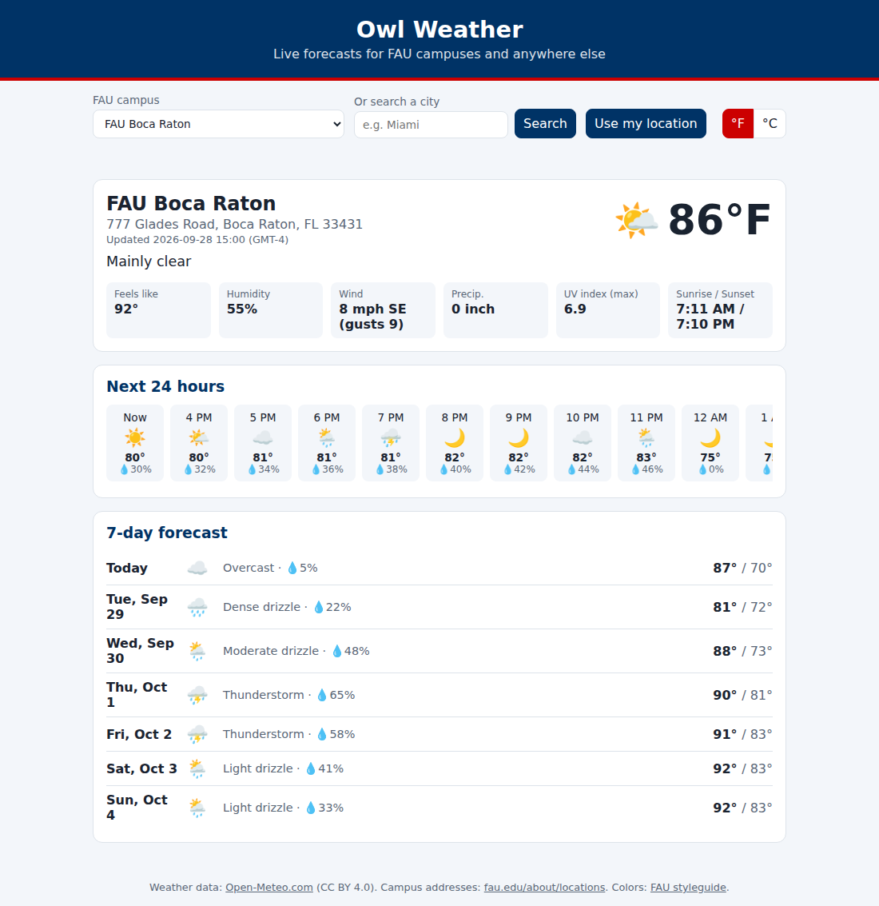

# Owl Weather

A no-install weather app with live forecasts for every FAU campus (and any city worldwide).

## Features
- Quick picker for all 6 FAU campuses (Boca Raton is the default)
- City search and "Use my location"
- Current conditions: temperature, feels-like, humidity, wind/gusts, precipitation, UV index, sunrise/sunset
- 24-hour and 7-day forecasts
- °F / °C toggle, mobile-friendly, dark mode

## Run it
Open `index.html` in a browser. No build step or API key needed.

## Sources
- Weather + geocoding: [Open-Meteo](https://open-meteo.com/) (free, no key, CC BY 4.0)
- Campus addresses: [fau.edu/about/locations](https://www.fau.edu/about/locations/), geocoded with OpenStreetMap Nominatim
- Brand colors (FAU Blue `#003366`, FAU Red `#CC0000`): [FAU styleguide](https://www.fau.edu/styleguide/colors/)
